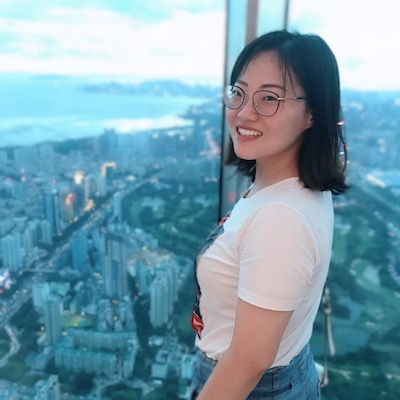

## Hi! This is Wenli :smiley:
I'm currently a machine learning engineer & software engineer in [Huawei Technologies](https://www.huawei.com/en/), Shenzhen, China. Previously I obtained my PhD degree in Condendensed Matter Physics and two Bachelor's degrees in Applied Physics and Applied Mathematics from [Beihang University](https://ev.buaa.edu.cn), Beijing, China. I have spent one year as an exchange student at [Tohoku University](https://www.tohoku.ac.jp/en/) in Sendai, Japan, and two years as a visiting PhD student at [The University of Utah](http://www.utah.edu), Salt Lake City, US.

I like new experiences, and I'm thrilled by new challenges -- when I move from Beijing:cn:, to Sendai:jp:, to Salt Lake City:us:, to Shenzhen:cn:, and when I transfer from **computational physics** to **computer sciences**. I advocate life long learning, but as I experience more and more, I found it quite natural for some old memories becoming vague (similar to the mechanism of Least Recently Used cache :hushed:). Therefore, I started this blog where I can log down any technical details so I can quickly recall them when needed some day in the future.

I admire power of science and technology, and I wish I can gradually be proficient with that power and to shed positive impacts to the world.

-- 2020.02
